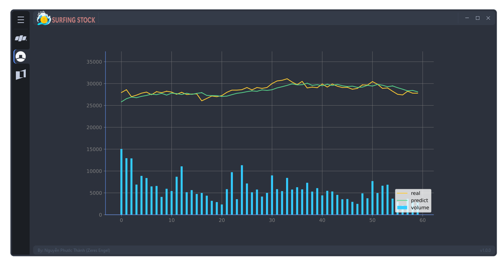

# SURFING STOCK

<div>
  <p align="center">
     
  </p>
</div>

Welcome to Surfing Stock, an application built using the QT library that utilizes a prediction model for stock prices based on an LSTM neural network. This app provides users with the ability to predict the stock prices for the following day using data from the seven previous days.

With its user-friendly interface, Surfing Stock is easy to use and provides users with reliable and insightful predictions. By utilizing the power of deep learning, Surfing Stock can help users make informed decisions in their investment strategies.

<p align="center">
  
  
  
  
  <a href="https://github.com/Zeres-Engel"></a>
</p>

# Table of Content
- [Overview](#overview)
- [Building the Model](#building-the-model)
    - [Data Analysis](#data-analysis)
    - [Data Preprocessing](#data-preprocessing)
    - [Layers (LSTM)](#layers-lstm)
    - [Optimizer (Adam)](#optimizer-adam)
- [Deploying the Product](#deploying-the-product)
    - [User Interface](#user-interface)
    - [Configuration](#configuration)

## Overview

The app is designed to automatically scrape stock data using the VNStock API and predict the stock price for the following day. The app displays the predicted stock price using a chart.
  

## Building the Model

To build a model, the process of analyzing stationary is an important step to ensure that the input data of the model is stable over time. Then, identifying the cycle with the highest energy impact will help you find patterns and trends in the data to improve the accuracy of the model.

  ### Data analysis

  To conduct stock analysis, we focus on analyzing the following three main components:
    -Stationary time-series
    -Seasonality
    -Histogram

  ### Data Preprocessing

  Based on the analysis of the main components we are interested in, we can build features using the following approaches:

    1. Adding values based on the strongest energy cycles:
      -Median
      -Rank
      -Variance
      -Mean
      -Standard Deviation

    2. Scaling the values using a normalization method such as StandardScaler to bring the data closer to a normal distribution.

    3. Feature engineering the data by taking a rolling window of 7 days to predict the next day's value.

  ### Layers (LSTM)

  The LSTM model is used to predict the stock price using the 31 extracted feature columns.

  ```python
  model = Sequential()
  model.add(LSTM(units = cells, return_sequences=True, activation='tanh', recurrent_activation='sigmoid', input_shape = (X_train.shape[1], X_train.shape[2])))
  model.add(Dropout(0.1))
  model.add(LSTM(units = cells, return_sequences=True, activation='tanh', recurrent_activation='sigmoid'))
  model.add(Dropout(0.1))
  model.add(LSTM(units = cells, return_sequences=True, activation='tanh', recurrent_activation='sigmoid'))
  model.add(Dropout(0.1))
  model.add(LSTM(units = cells, return_sequences=True, activation='tanh', recurrent_activation='sigmoid'))
  model.add(Dropout(0.1))
  model.add(LSTM(units = cells, return_sequences=True, activation='tanh', recurrent_activation='sigmoid'))
  model.add(Dropout(0.1))
  model.add(LSTM(units = cells))
  model.add(Dropout(0.1))
  model.add(Dense(units = len(cols_y)))         
  ```

  ### Optimizer (Adam)

  Using the Adam optimizer for stock price prediction models has several benefits, including stability, adaptiveness, and efficiency. It helps the model converge faster, achieve better results, and optimize more efficiently than other optimizers such as SGD or Adagrad.

  ```python
  model = CreateModel(387)

  model.compile(optimizer = Adam(learning_rate = 0.00001), loss = 'mean_squared_error', metrics = ['accuracy'])
  history = model.fit(X_train, y_train, epochs= 1, batch_size= 1, use_multiprocessing= True, validation_split= 0.2, shuffle= True)
  ```

## Deploying the Product

To use the Surfing Stock app, users simply need to download and install the required libraries and run the main.py file or         https://drive.google.com/file/d/1OmZuhPzRKWvL9k_hTiSArxFXpCDq9sx- . The app will automatically scrape stock data and use the saved LSTM model to make predictions for the following day's stock price.

The predicted stock price is displayed on the app's user interface, along with a chart that shows the historical stock prices and the predicted stock price for the next day.

The app also includes a settings menu where users can adjust the time range of the historical stock data displayed on the chart, as well as the time range of the predicted stock price.

Overall, the Surfing Stock app provides a user-friendly and efficient way for users to make informed decisions in their investment strategies by utilizing the power of deep learning to predict stock prices.

  ### User Interface

  The product has a user interface that displays the predicted stock price using a chart. The chart is designed to be easy to read and understand.

  Closing price chart:

  

  Model quality rating chart:

  

  ### Configuration

  The Surfing Stock app has a user-friendly interface that displays predicted stock prices using a chart. To run this code, programers need to install the required libraries, which are listed in the requirements.txt file.
