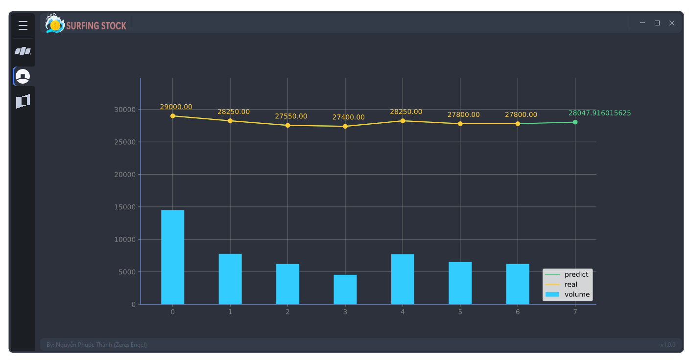

# SURFING STOCK

<div>
  <p align="center">
     
  </p>
</div>

Welcome to Surfing Stock, an application built using the [QT](https://en.wikipedia.org/wiki/Qt_(software)) library that utilizes a prediction model for stock prices based on an [LSTM](https://en.wikipedia.org/wiki/Long_short-term_memory) neural network. This app provides users with the ability to predict the stock prices for the following day using data from the seven previous days.

With its user-friendly interface, Surfing Stock is easy to use and provides users with reliable and insightful predictions. By utilizing the power of deep learning, Surfing Stock can help users make informed decisions in their investment strategies.


[](https://github.com/{Zeres-Englel})

# Table of Content
- [Overview](#overview)
- [Building the Model](#building-the-model)
    - [Data Understanding](#data-understanding)
    - [Data Preprocessing](#data-preprocessing)
    - [Layers (LSTM)](#layers-lstm)
    - [Optimizer (Adam)](#optimizer-adam)
- [Deploying the Product](#deploying-the-product)
    - [User Interface](#user-interface)
    - [Configuration](#configuration)

## Overview
The app is designed to automatically scrape stock data using the VNStock API and predict the stock price for the following day. The app displays the predicted stock price using a chart.



## Building the Model
### Data Understanding
The data is collected using the VNStock API, and the following data variables are used for predicting the stock price:
- Date
- Open
- High
- Low
- Close
- Volume

### Data Preprocessing
Data preprocessing is performed to extract 31 feature columns from the raw data. These features are then used to build the LSTM model. 
- Volume
- Candlestick patterns
- Median prices
- Simple moving averages
- Skewness
- Kurtosis
-Technical indicators (RSI, MACD, etc.)
By extracting and using these features, we can better capture the patterns and trends in the stock price data and improve the accuracy of our predictions.

### Layers (LSTM)
The LSTM model is used to predict the stock price using the 31 extracted feature columns.
```python
model = Sequential()
cells = 248
model.add(LSTM(units = cells, activation='tanh', recurrent_activation='sigmoid', input_shape = (x_train.shape[1], x_train.shape[2])))
model.add(Dropout(0.1))
model.add(Dense(units = len(cols_y))) 
```

### Optimizer (Adam)
Using the Adam optimizer for stock price prediction models has several benefits, including stability, adaptiveness, and efficiency. It helps the model converge faster, achieve better results, and optimize more efficiently than other optimizers such as SGD or Adagrad.

## Deploying the Product
### User Interface
The product has a user interface that displays the predicted stock price using a chart. The chart is designed to be easy to read and understand.

### Configuration
The product requires the installation of the necessary libraries to run. A requirements.txt file is included to make the installation process easier.
